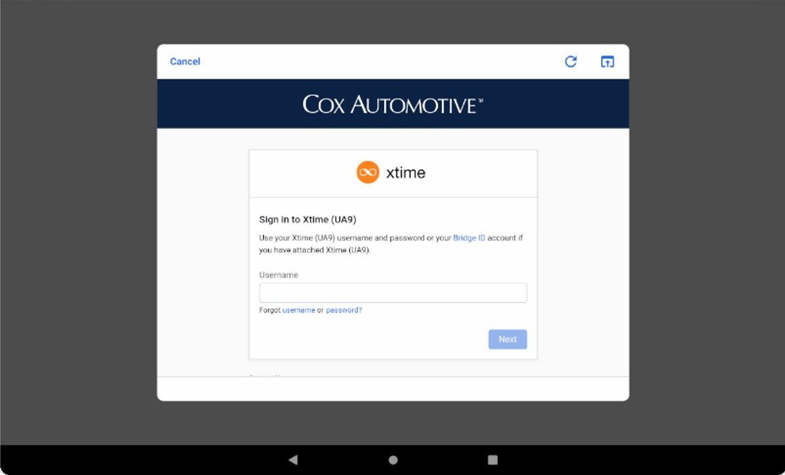
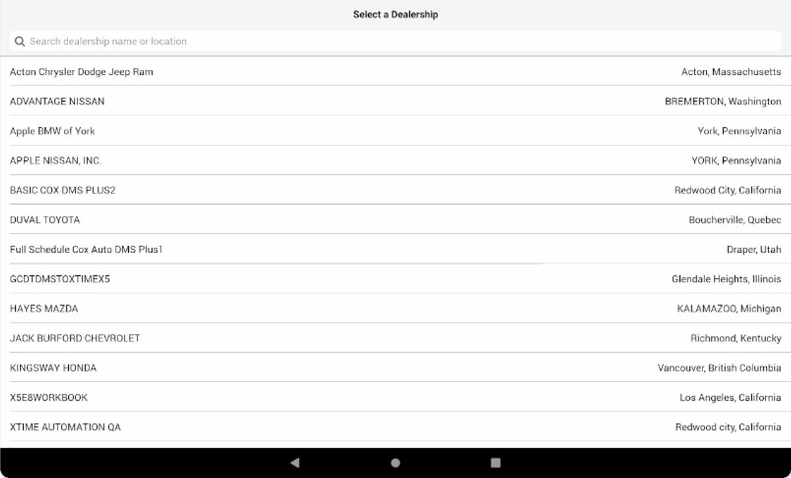
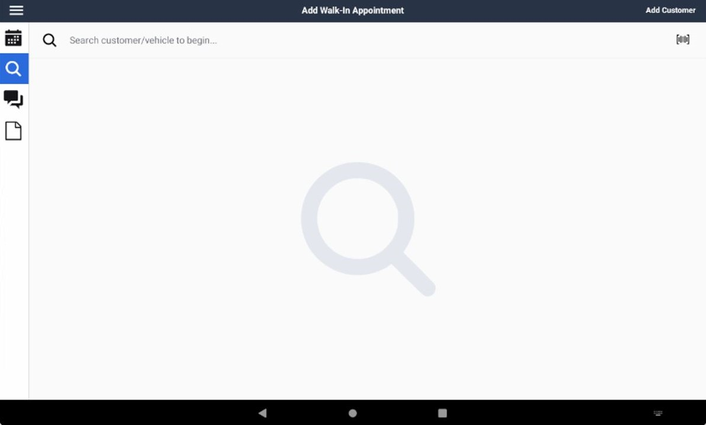
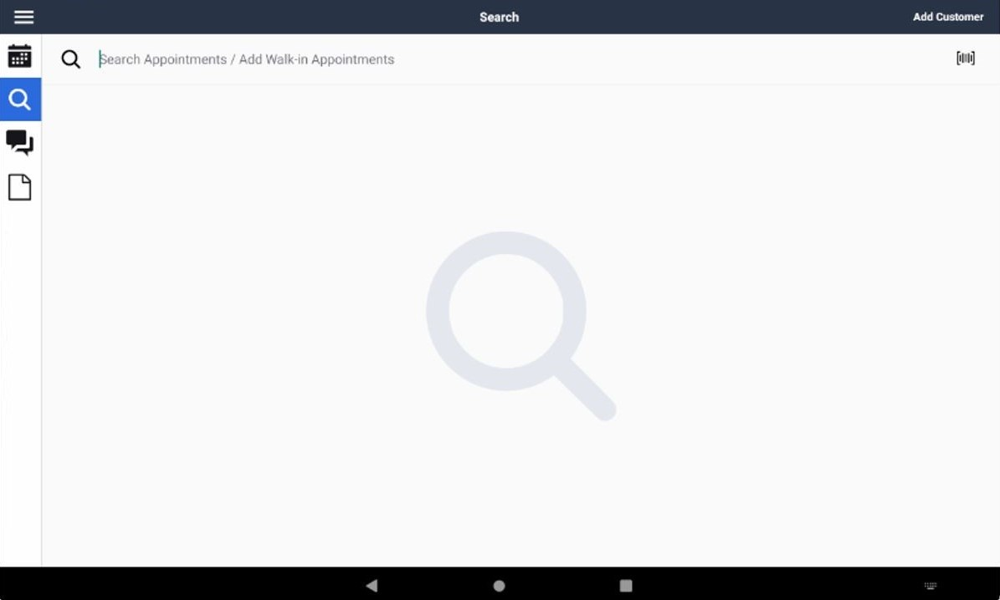
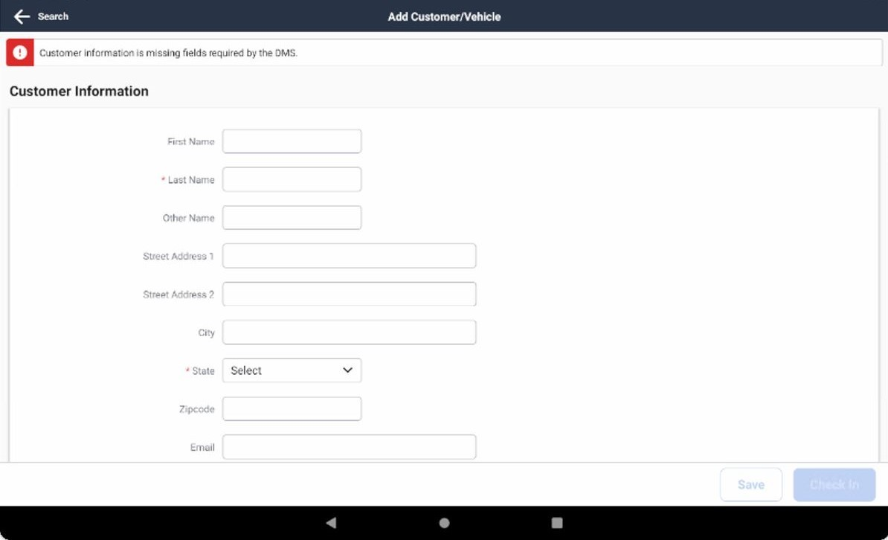
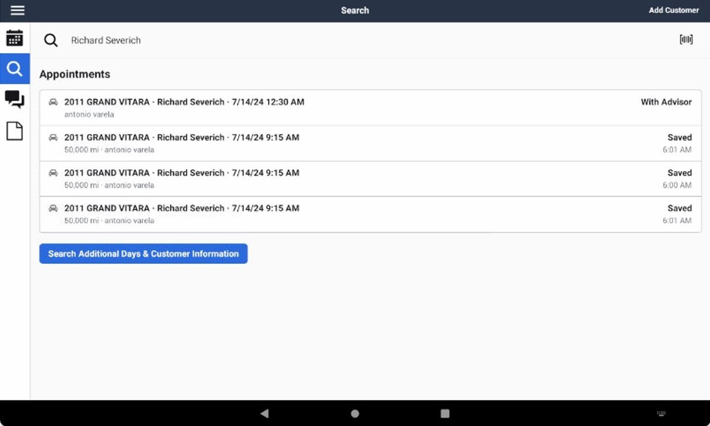
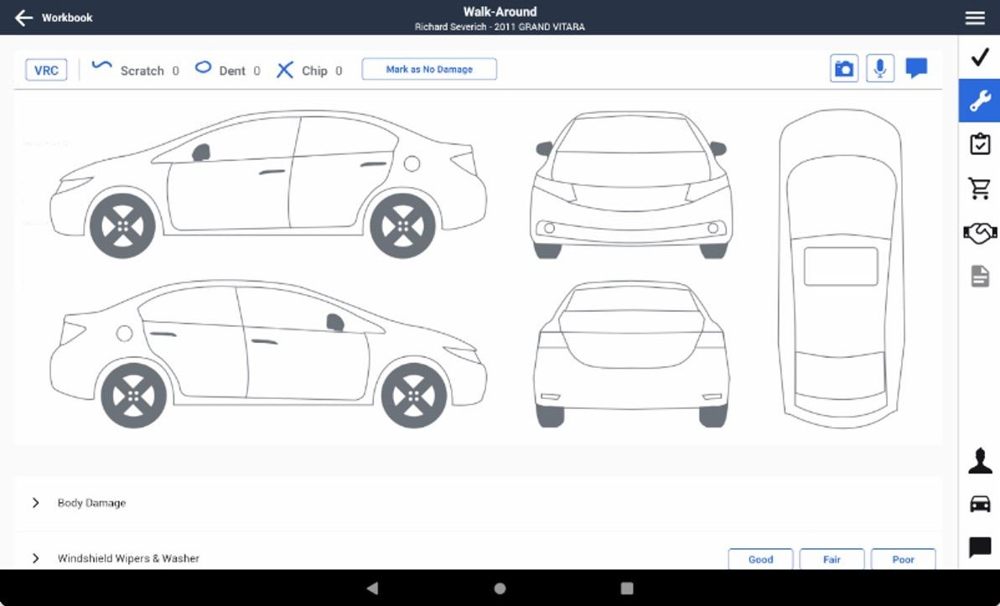
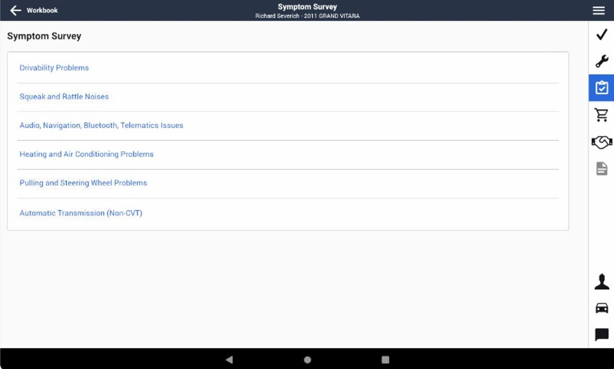
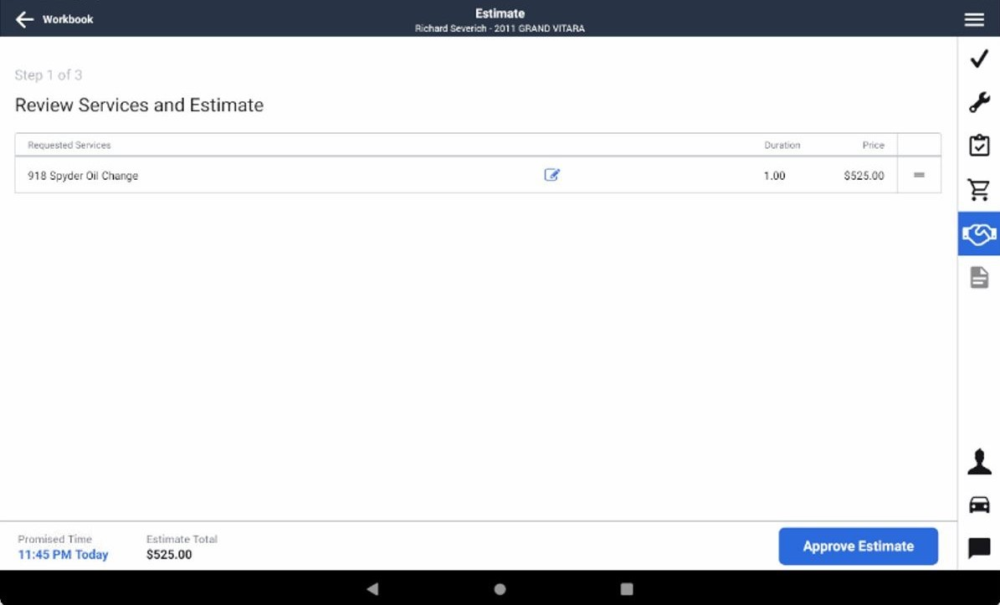
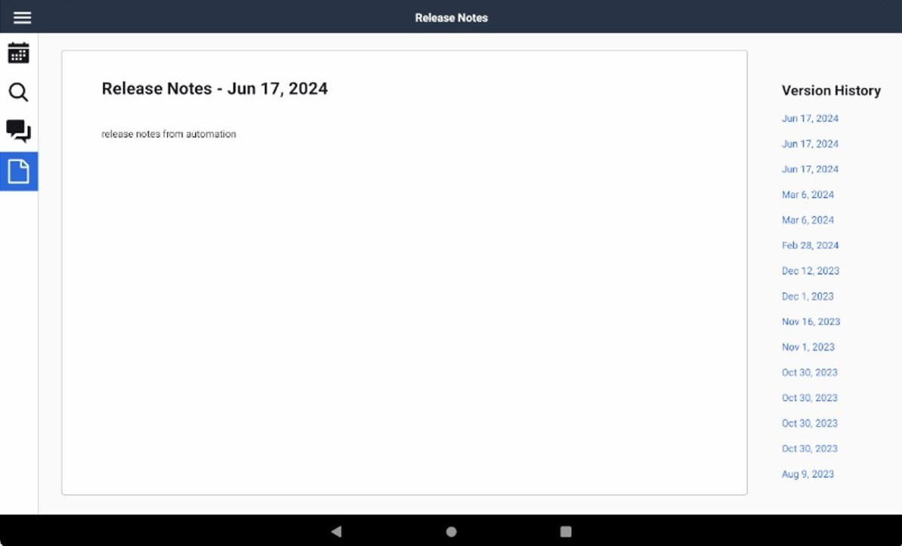

# Engage8

## Login into the app
* Press the sign button
* Put your username credentials
* Put your password credentials
#### Screen 1
The selectors for this screen are in ```LoginScreen1``` java class.
<p align="center">
  
</p>

#### Screen 2
The selectors for this screen are in ```LoginScreen2``` java class.
<p align="center">
  
</p>

#### Screen 3
The selectors for this screen are in ```LoginScreen3``` java class.
<p align="center">
  
</p>

## Select Dealership
The selectors for this screen are in ```SelectDealershipScreen``` java class.
<p align="center">
  
</p>
Search and select a dealership (XTIME AUTOMATION QA)
<p align="center">
  
</p>

## Workbook
###### This is the screen when you can see your workbook by advisor and date
The selectors for this screen are in ```WorkbookScreen``` java class.
<p align="center">
  
</p>

#### Add walk in appointment screen
###### To see this screen you need to click on the (+) button in 'Workbook screen'
The selectors for this screen are in ```AddWalkInAppointmentScreen``` java class.
<p align="center">
  
</p>

## Left menu
The selectors for this left screen are in ```LeftMenuScreen``` java class.
<p align="center">
  
</p>

## Search appointments
The selectors for this screen are in ```SearchAppointmentScreen``` java class.
<p align="center">
  
</p>

### Add customer screen
The selectors for this screen are in ```SearchAppointmentScreen``` java class.
<p align="center">
  
</p>

### Search customer screen
The selectors for this screen are in ```SearchAppointmentCustomerScreen``` java class.
<p align="center">
  
</p>

### Select customer screen
The selectors for this screen are in ```SearchAppointmentCustomerScreen``` java class.
<p align="center">
  
</p>

### Check-in
The selectors for this screen are in ```CheckInScreen``` java class.
<p align="center">
  
</p>

#### Walk around screen
The selectors for this screen are in ```WalkAroundScreen``` java class.
<p align="center">
  
</p>

#### Symptom survey screen
The selectors for this screen are in ```SymptomSurveyScreen``` java class.
<p align="center">
  
</p>

#### Services screen
The selectors for this screen are in ```ServicesScreen``` java class.
<p align="center">
  
</p>

#### Estimate step 1
The selectors for this screen are in ```EstimateScreen``` java class.
<p align="center">
  
</p>

#### Estimate step 2
The selectors for this screen are in ```EstimateScreen``` java class.
<p align="center">
  
</p>

#### Estimate step 3
The selectors for this screen are in ```EstimateScreen``` java class.
<p align="center">
  
</p>

## Customer messages
The selectors for this screen are in ```CustomerMessagesScreen``` java class.
<p align="center">
  
</p>

## Release notes
The selectors for this screen are in ```ReleaseNotesScreen``` java class.
<p align="center">
  
</p>
