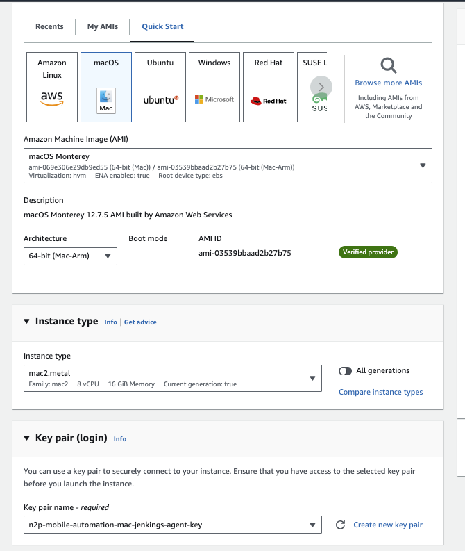
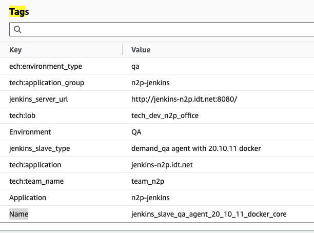
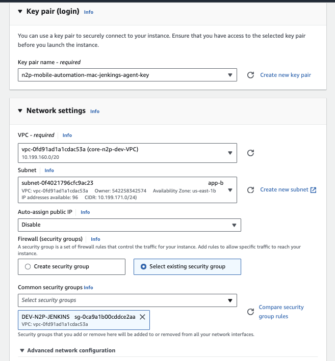
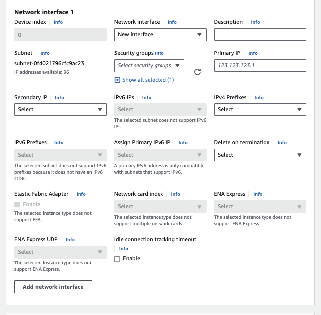
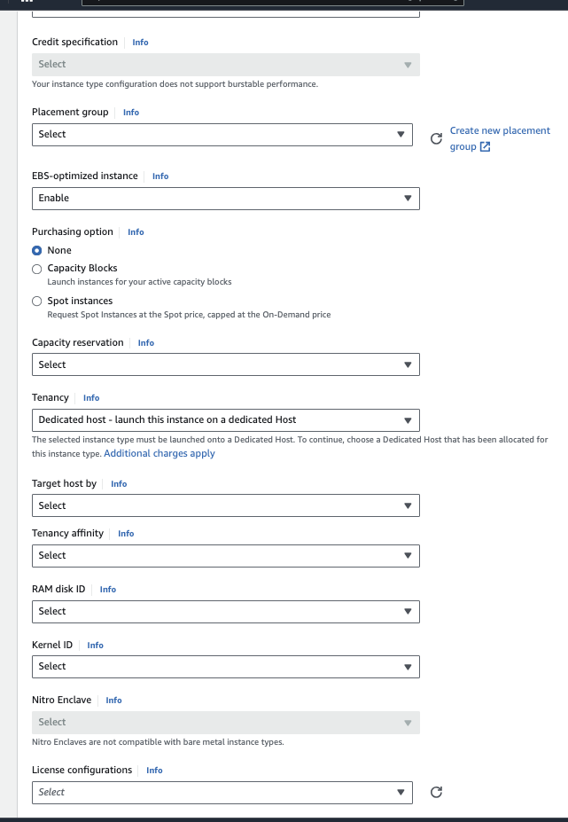
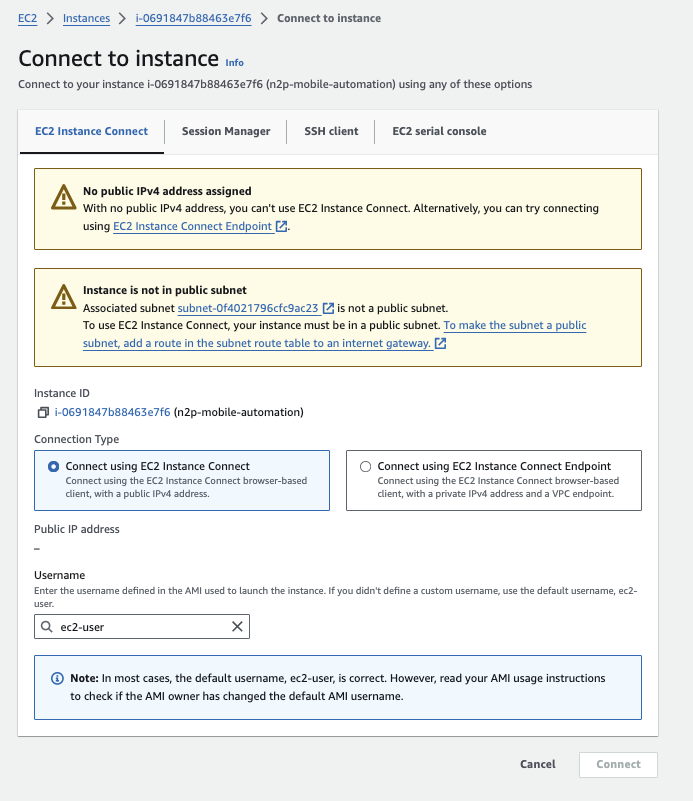

# Create Amazon Elastic Compute Cloud (Amazon EC2)

* Create ticket for AWS Credentials on ```https://idtjira.atlassian.net/jira/projects ```
  - AWS portal: ```N2P Dev  (aws-n2p-dev@idt.net)```

* Once you have credentials,  following instructions to login for example
  - go to ```https://idtjira.atlassian.net/wiki/spaces/HELPKB/pages/1675821399/AWS+Management+Console+how+to+sign+in```
  - go to ```https://idtcorp.awsapps.com/start```
  - Username: "rseveric"
  - Password: "your password"
  - Code: "RSA Security Code"

<p align="center">
  
</p>

* Then create EC2 with the following properties
  * aws portal: ```N2P Dev  (aws-n2p-dev@idt.net)```
  * Region: ```US East (N. Virginia)```
  * ec2 name: ```n2p-mobile-automation```
  * Platform: ```macOS (Inferred)```
  * Security groups: ```sg-0ca9a1b00cddce2aa (DEV-N2P-JENKINS)```
  * IAM Role: ```jenkinsslave```
  * VPC ID (Virtual Private Cloud): ```vpc-0fd91ad1a1cdac53a (core-n2p-dev-VPC)```
  * Subnet ID: ```subnet-0f4021796cfc9ac23 (app-b) ```

<p align="center">
  
</p>

<p align="center">
  
</p>

<p align="center">
  
</p>

<p align="center">
  
</p>

<p align="center">
  
</p>

<p align="center">
  
</p>

<p align="center">
  
</p>

<p align="center">
  
</p>

<p align="center">
  
</p>


Note: you can see more details on: ```Instance-details-EC2-us-east.html``` that is on ```readme-files-07-aws``` folder
