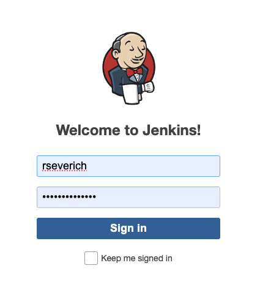
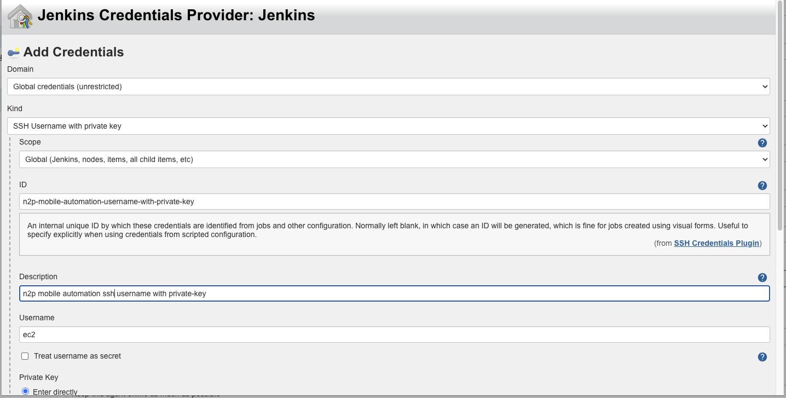
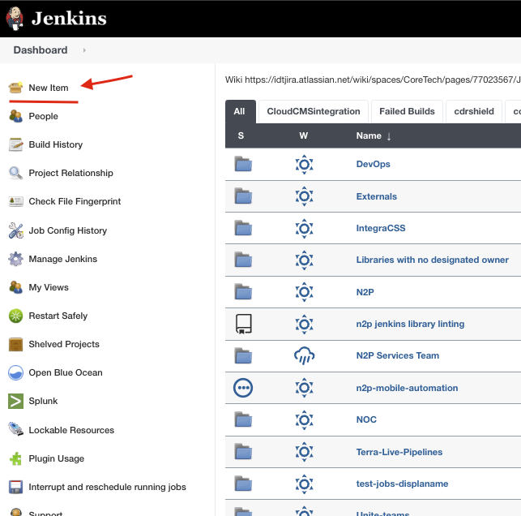

# JENKINS CONFIGURATION

## ADD AWS EC2 AS JENKINS EXECUTOR
* Login to:  ```http://jenkins-n2p.idt.net:8080/login```
<p align="center">
  
</p>

* Go to executor:
<p align="center">
  
</p>

* Go to new node:
<p align="center">
  
</p>


* Create jenkins creentials ```SSH username with private key ``` note: use your AWS .pem key

<p align="center">
  
</p>

<p align="center">
  
</p>

* Finally fill textboxes:
<p align="center">
  
</p>

## ADD JENKINS PIPELINE

* Go new item:
<p align="center">
  
</p>

* Select pipeline option:
<p align="center">
  
</p>

* Copy the pipeline that is in jenkins folder on root of this project.
<p align="center">
  
</p>
