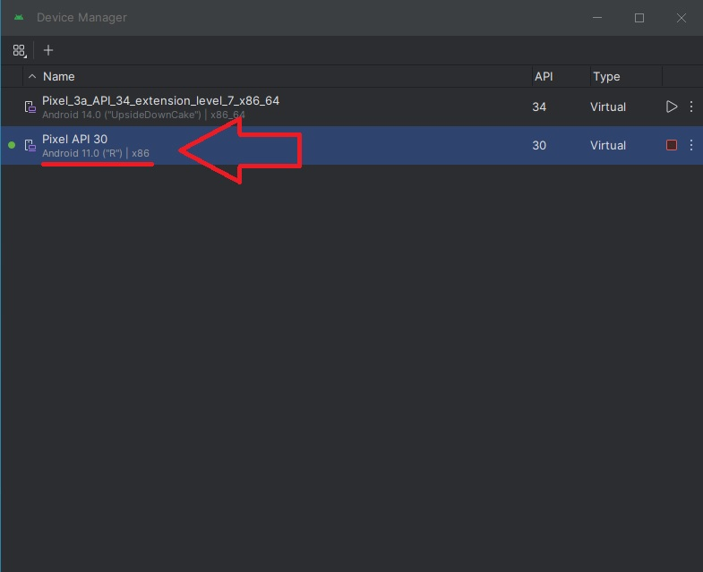

# Configure DesiredCapabilities capabilities

* ```deviceName``` you can see in your device: eg.```Pixel API 30 (Android 11.0)```
* ```platformName``` you can see in your device. eg. ```11.0``` 
* ```platformVersion``` you can see in your device: eg. ```Android```
<p align="center">
  
</p>

* ```udid``` you can get it with ```adb devices``` command: eg. "emulator-5554"
<p align="center">
  
</p>

* Install ```Apk Info``` in your device to get ```appPackage``` and ```appActivity```
<p align="center">
  
</p>

* ```appPackage``` you can get it from ```Apk Info``` app, eg. ```com.idt.n2p```
<p align="center">
  
</p>

* ```appActivity``` you can get it from ```Apk Info``` app, eg. ```com.idt.n2p.MainActivity```
<p align="center">
  
</p>

* ```appiumUrl``` you can get this information when you run appium. eg. ```http://192.168.0.7:4723/wd/hub```
<p align="center">
  
</p>
