# XCODE

## SET UP XCODE AND SIMULATOR

* Check your MAC OS version: ```apple -> About This Mac```
<p align="center">
  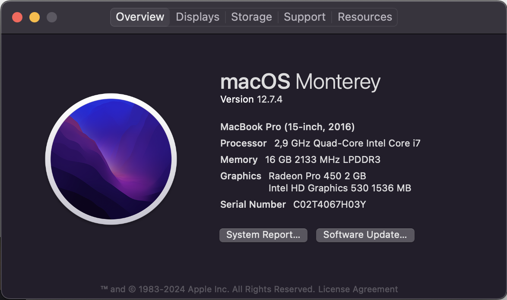
</p>

* Dowload and install ```Xcode``` from ```https://xcodereleases.com/``` according your MAC OS VERSION
<p align="center">
  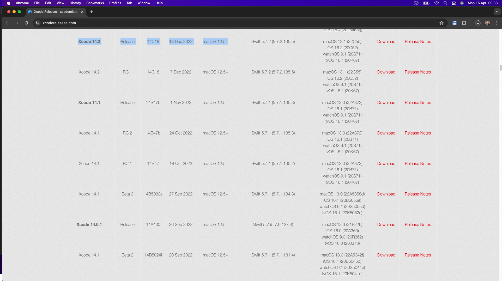
</p>

* Open Xcode and go to ```Create a new Xcode Project```
<p align="center">
  
</p>

* Select ```App``` and click ```Next``` button
<p align="center">
  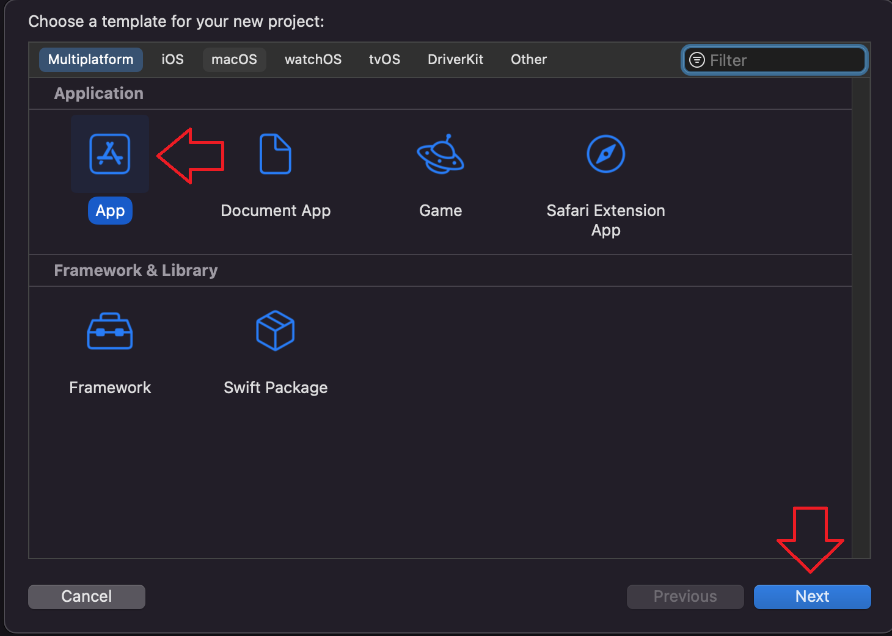
</p>

* Write ```Product Name``` and ```Organization```, then click ```Next``` button
<p align="center">
  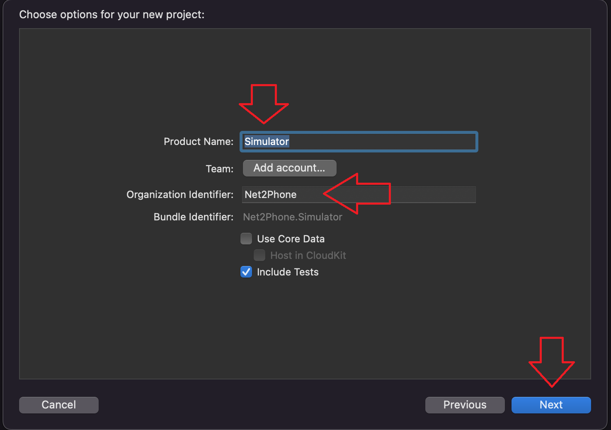
</p>

* Then select some project location and press ```Next``` button
<p align="center">
  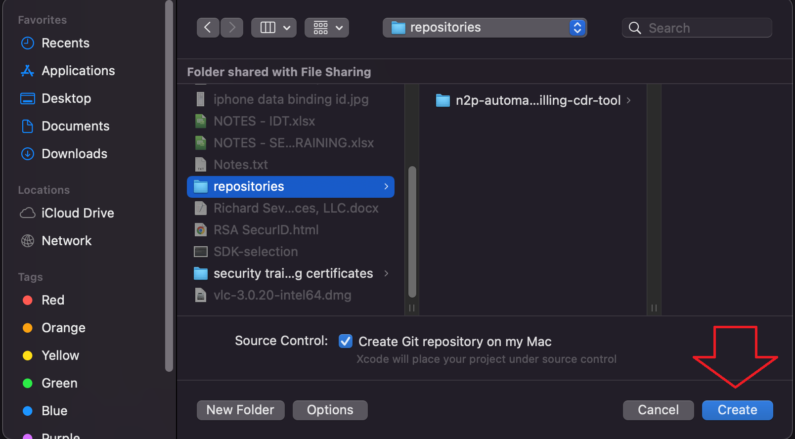
</p>


## OPTIONAL VERIFICATION

* A new project will be created, then go manage “Manage Schemas”
<p align="center">
  
</p>

* Verify that there is only one option and it is selected
<p align="center">
  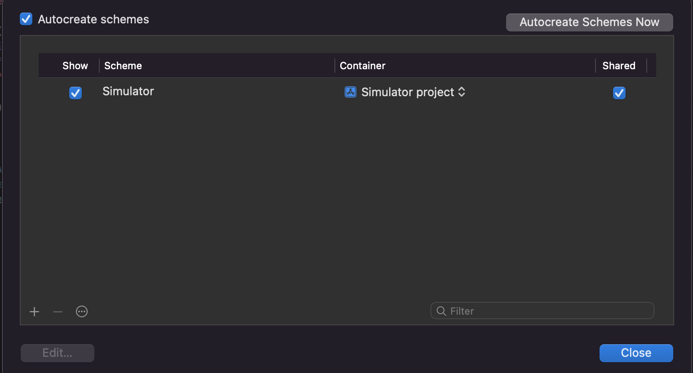
</p>


## OPTIONAL CREATE NEW DEVICE

* Then go to ```Add additional Simulators```
<p align="center">
  
</p>

* Then write the simulator ```name``` and select the ``` OS version```, Then press ```create``` button
<p align="center">
  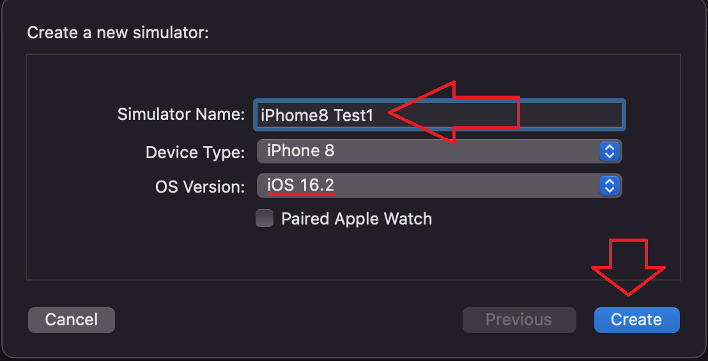
</p>

* Then ```devices and simulators``` screen will open, and you can see all simulators and their details, then close it.
<p align="center">
  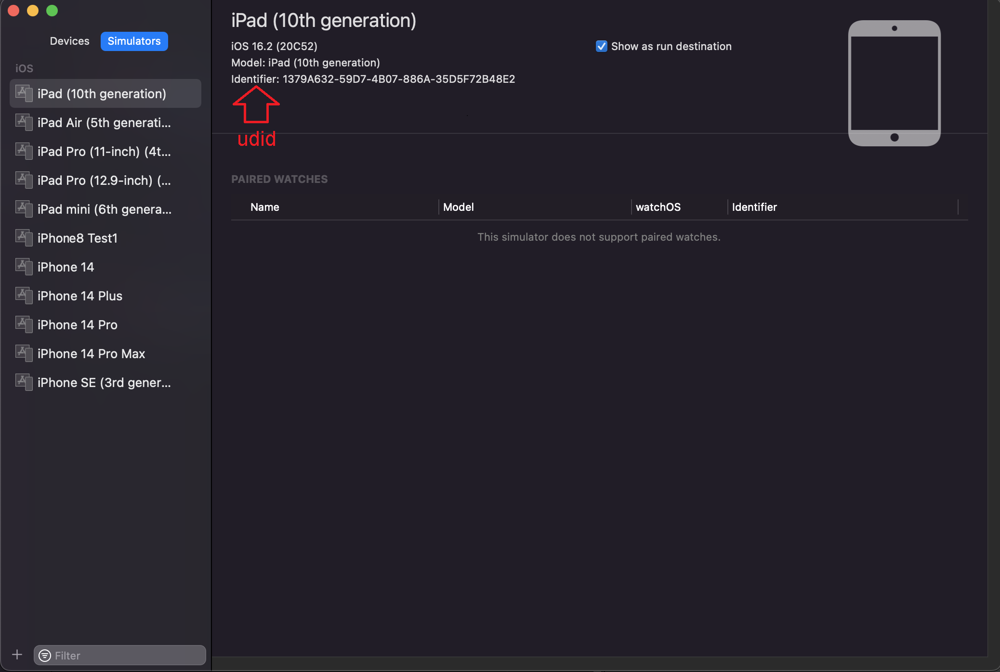
</p>


## CONTINUE

* Select a device (You can select a device created by you or any that comes by default)
<p align="center">
  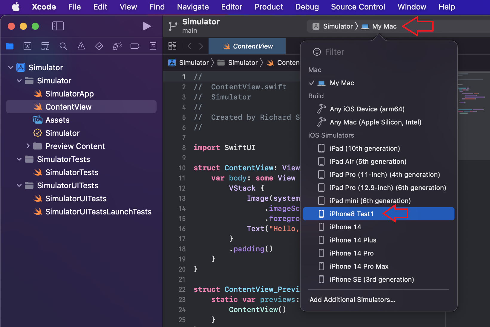
</p>

<p align="center">
  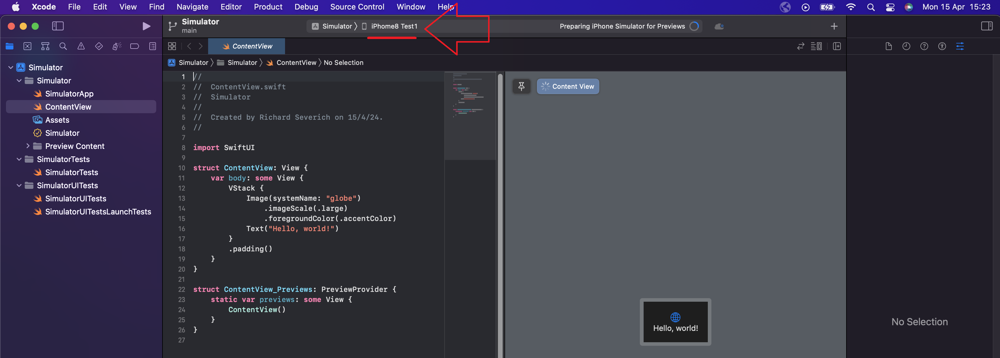
</p>

* Then go ```Xcode -> Preferences```
<p align="center">
  
</p>

* Within ```Preferences``` go to ```Locations``` and select ```Command Line Tools```
<p align="center">
  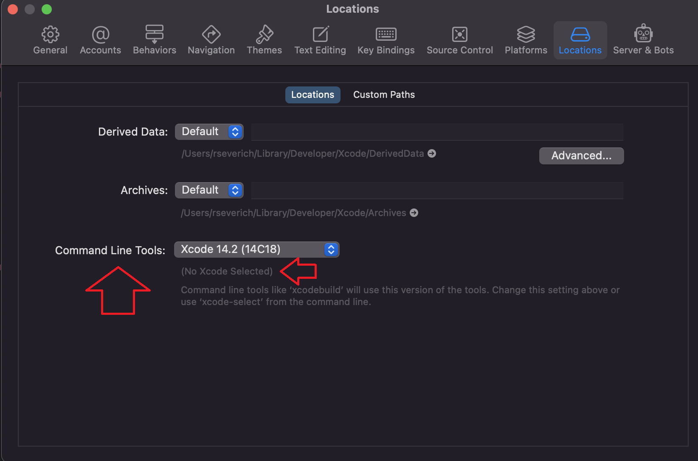
</p>

<p align="center">
  
</p>

* Then run the simulator ```Product -> Run```
<p align="center">
  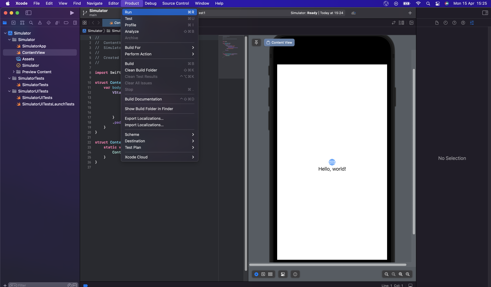
</p>

<p align="center">
  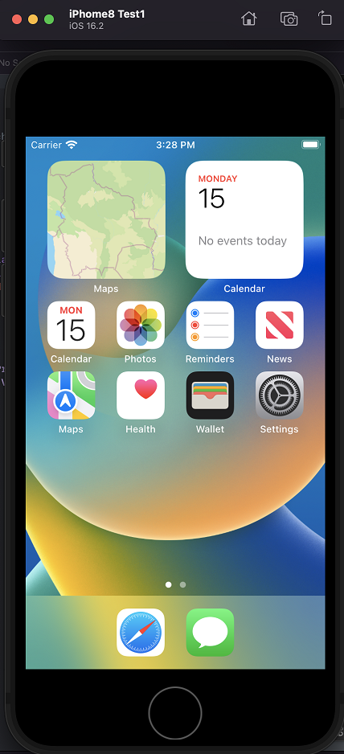
</p>


