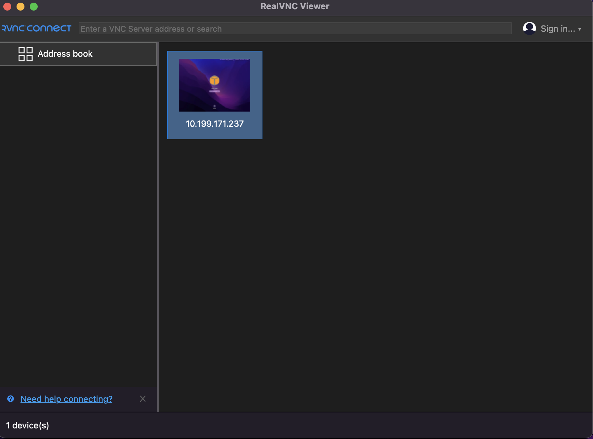

# Get Connection (Amazon EC2)

## Get ssh connection

* Go folder where .pem key is:  ```cd Desktop/richard/aws-key```
* Give permissions ```chmod 400 file.pem``` 
* Example:  ```chmod 400 "n2p-mobile-automation-mac-jenkings-agent-key.pem"```
* Get ssh connection: ```ssh -i “file.pem” ec2-user@instanceid```
* Example: ```ssh -i "n2p-mobile-automation-mac-jenkings-agent-key.pem" ec2-user@10.199.171.237```


## Copy files via ssh connection
* Copy apk and app files to server: ```scp -i mykey.pem somefile.txt root@my.ec2.id.amazonaws.com:/Users/```
* Example: 
  * first go to .pem file folder eg: ```cd /Users/rseverich/Desktop/richard/aws-key```
  * then execute: 
```
scp -i "n2p-mobile-automation-mac-jenkings-agent-key.pem" /Users/rseverich/Desktop/app-files/4.0.0build520/app-alpha-release.apk  ec2-user@10.199.171.237:/Users/ec2-user/Desktop/app-files/4.0.0build520/app-alpha-release.apk
```


## Login UI
* Install VNC client: ```https://www.realvnc.com/en/connect/download/viewer/```
* Install ARD client: ```https://support.apple.com/en-us/106547```
* you can follow this oficial steps:  ```https://docs.aws.amazon.com/AWSEC2/latest/UserGuide/connect-to-mac-instance.html```
* Get ssh connection: ```ssh -i "n2p-mobile-automation-mac-jenkings-agent-key.pem" ec2-user@10.199.171.237```
* Set up a password for the ec2-user account using the passwd command as follows:  
```
sudo passwd ec2-user
```
* Install and start macOS Screen Sharing using the following command.
```
sudo launchctl enable system/com.apple.screensharing
sudo launchctl load -w /System/Library/LaunchDaemons/com.apple.screensharing.plist
```
* Disconnect from your instance by typing exit and pressing Enter.
* From your computer, connect to your instance using the following ssh command.
  * Command:
```
ssh -L 5900:localhost:5900 -i /path/key-pair-name.pem ec2-user@instance-public-dns-name
```
  * Example:
```
ssh -L 5900:localhost:5900 -i "n2p-mobile-automation-mac-jenkings-agent-key.pem" ec2-user@10.199.171.237
```

* From your local computer, use the ARD client or VNC client that supports ARD to connect to localhost:5900. 
For example, use the Screen Sharing application on macOS as follows:
  - Open Finder and select Go.
  - Select Connect to Server.
  - In the Server Address field, enter vnc://localhost:5900.
  - Log in as prompted, using ec2-user as the user name and the password that you created for the ec2-user account.

<p align="center">
  
</p>

Note: you can see more details on: ```Connect-to-your-Mac-instance-Amazon-Elastic-Compute-Cloud.html``` that is on ```readme-files-07-aws``` folder
