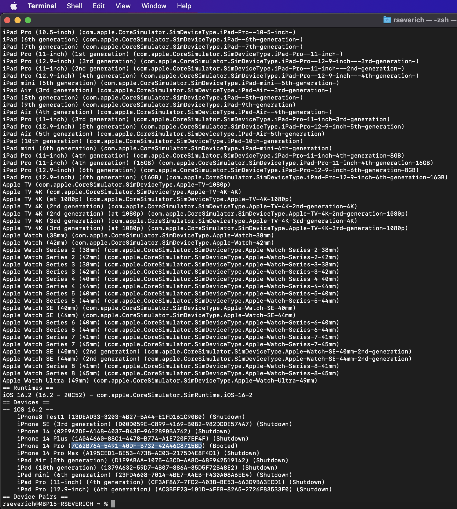

# Configure DesiredCapabilities capabilities MAC

* In Xcode, go to ```Devices and Simulators```
<p align="center">
  
</p>

* Select your Device and you are able to see all details
* ```deviceName``` you can see in your device: eg.```iPhone8 Test1```
* ```platformName``` you can see in your device. eg. ```iOS```
* ```platformVersion``` you can see in your device: eg. ```16.2```
* ```udid``` you can see in your device: eg. ```13DEAD33-3203-4B27-BA44-E1FD161C90B0```
<p align="center">
  
</p>

* Also con you can see the ```udid``` with ```xcrun simctl list``` command
<p align="center">
  
</p>

* ```appiumUrl``` you can get this information when you run appium. eg. ```http://192.168.0.7:4723```
<p align="center">
  
</p>
