# REACT NATIVE

* This projects was init with:  ``` npx react-native@latest init mobile001 ```

# DEPLOY

## Install Dependencies

* Install node version: ```v18.16.1```
* Install npm version: ```9.5.1```
* Install npx version: ```9.5.1```
* Install java version: ```17``` and add env variables

## Install Android Studio

* Download Android Studio from: ```https://developer.android.com/studio```
<p align="center">
  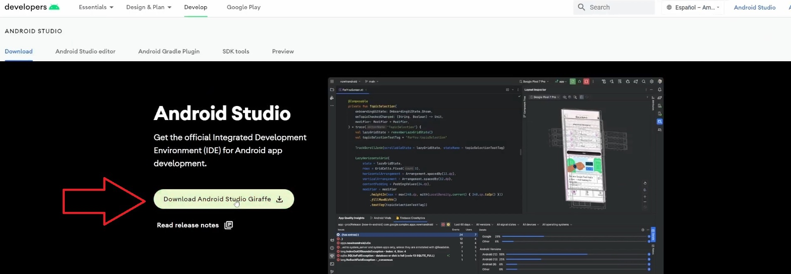
</p>

* Install Android Studio:
<p align="center">
  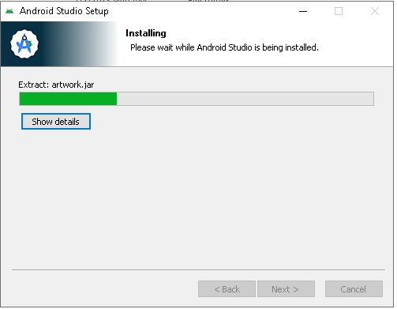
</p>

## Create a New Device in Android Studio

* Open Android Studio and go to ```More actions > Virtual Device manager```:
<p align="center">
  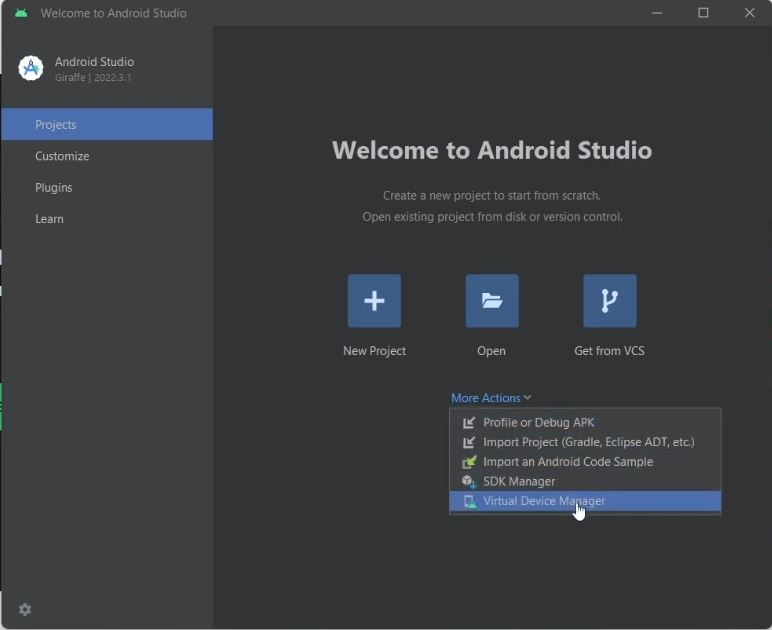
</p>

* Click on "Create Virtual" in Device Manager:
<p align="center">
  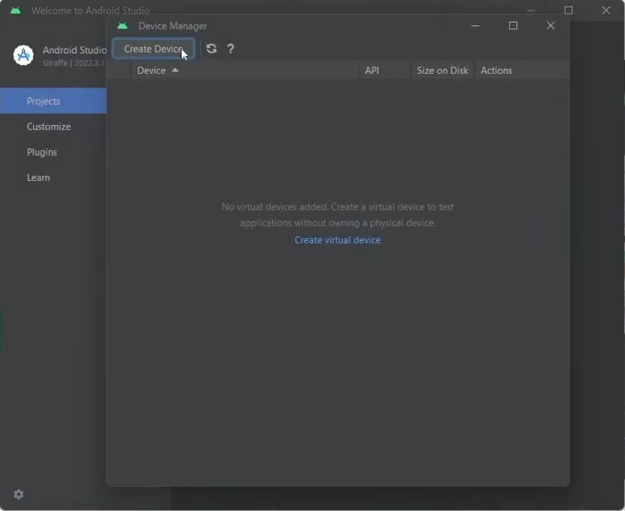
</p>

* Select hadware, you can select ```Pixel 7 Pro``` and press ```Next``` button :
<p align="center">
  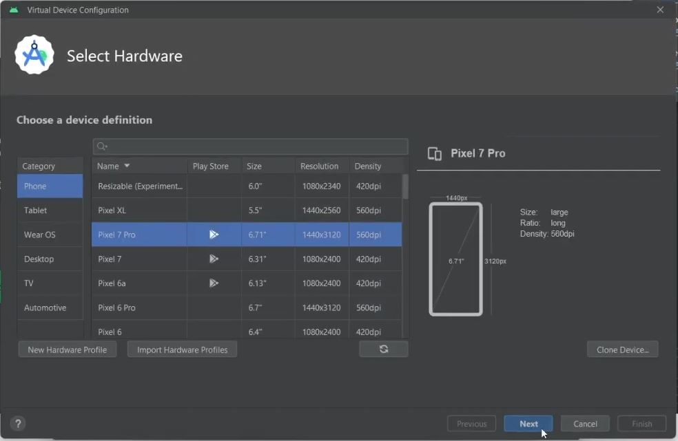
</p>

* Download and select de android version you can select ```Android 11.0``` and press ```Next``` button : 
<p align="center">
  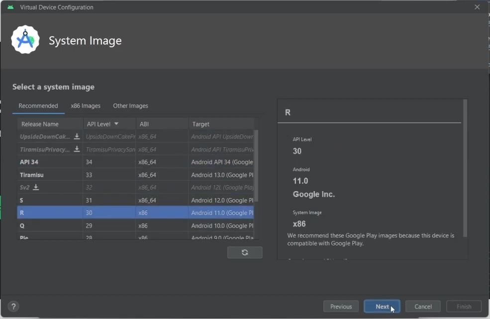
</p>

* Leave everything as it is and press ```Finish``` button : 
<p align="center">
  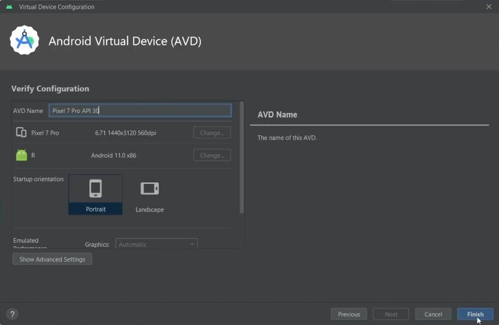
</p>

* With this we have finished creating a new device and we will view it in the ```Device Manager``` screen, now we can run it by pressing the ```play``` button
<p align="center">
  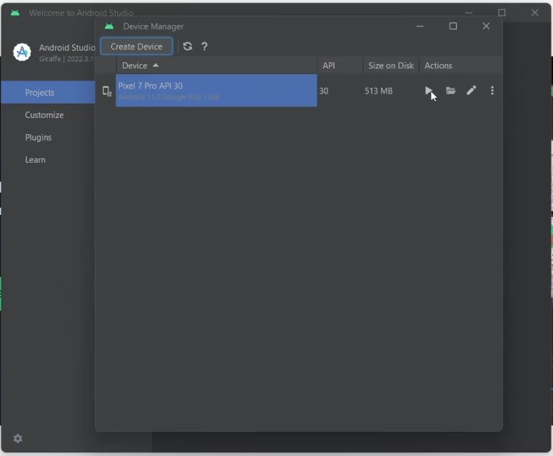
</p>

* Once it run, you can see your device opened
<p align="center">
  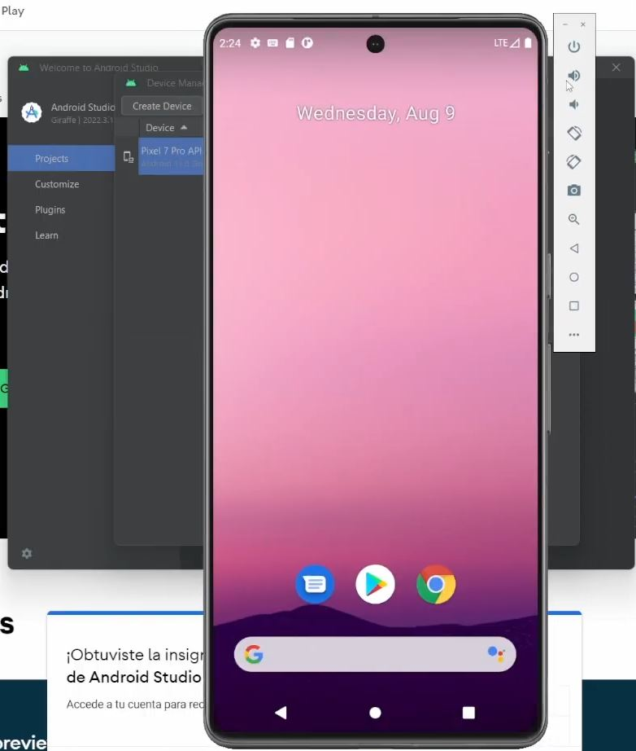
</p>

## Configure SDK in Android Studio

* Go to a ```SDK Manager```
<p align="center">
  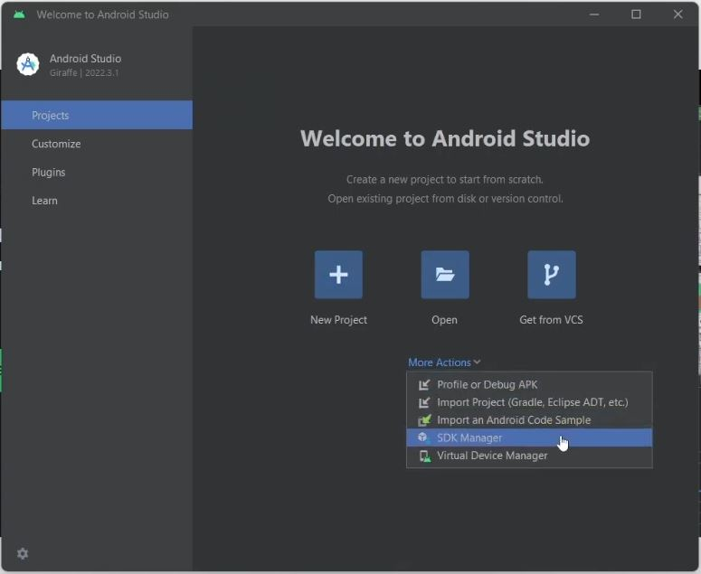
</p>

* Select ```Android 11.0 (R) 30``` SDK Platform and press ```Apply``` button. (Note: before selecting, it must be downloaded.)
<p align="center">
  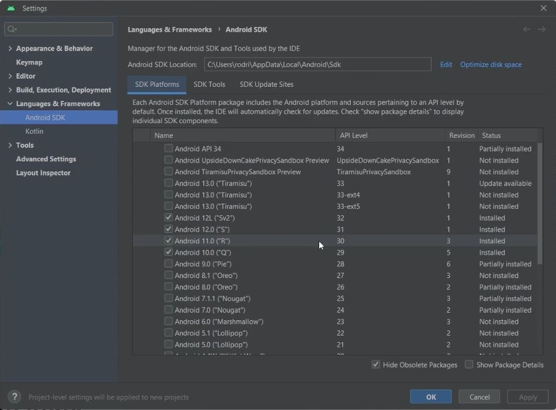
</p>

* Then go to ```SDK tools``` and select ```Android SDK Command-line Tools (latest)``` and press ```Apply``` button and ```Ok``` button. (Note: before selecting, it must be downloaded.)
<p align="center">
  
</p>

<p align="center">
  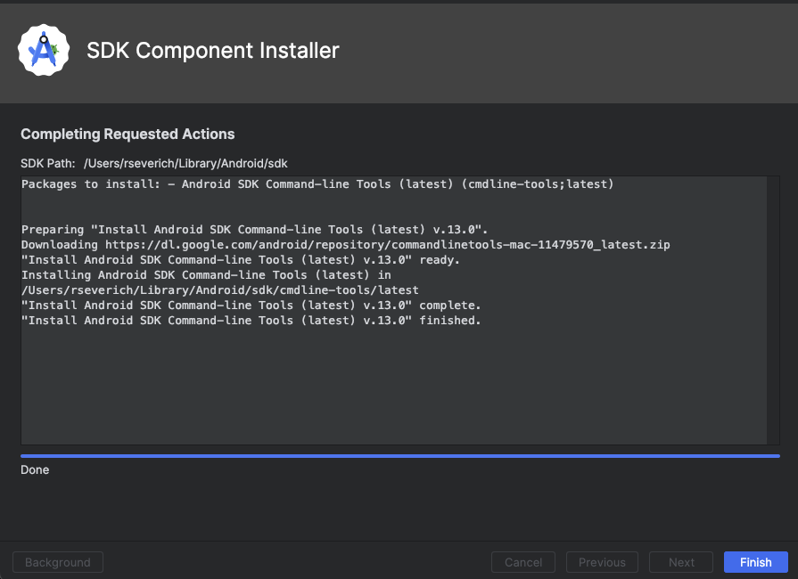
</p>

* After that, Add ```Sdk``` and ```Platform tools``` to environment variables
<p align="center">
  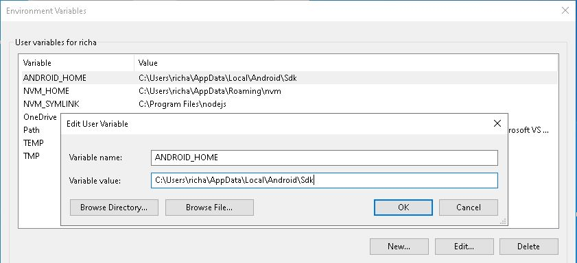
</p>
<p align="center">
  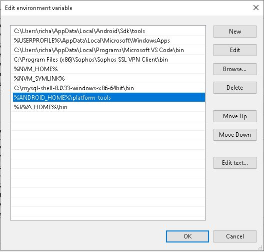
</p>

* Then test with ``` adb devices``` in cmd
<p align="center">
  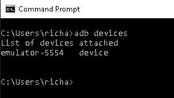
</p>


# RUN

All the following commands should be run in the root folder of the project run (mobile001)

* npm install

* check dependencies run  ```npx react-native doctor``` in cmd in root folder of the project,  If incompatibility errors appear, fix the errors.
<p align="center">
  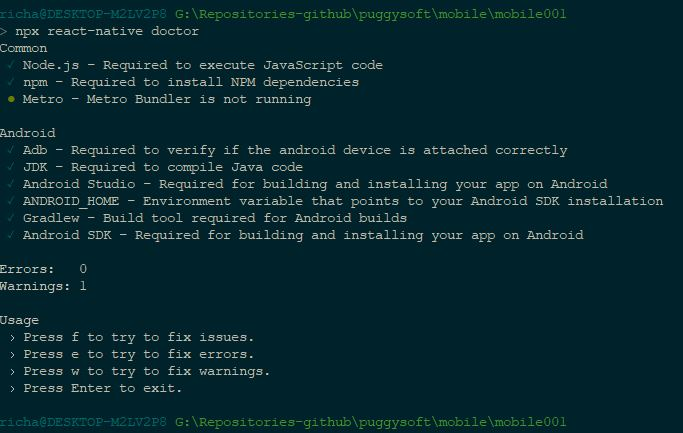
</p>

* run app only first time: ```npm run android```

* run app: ```npm start```
